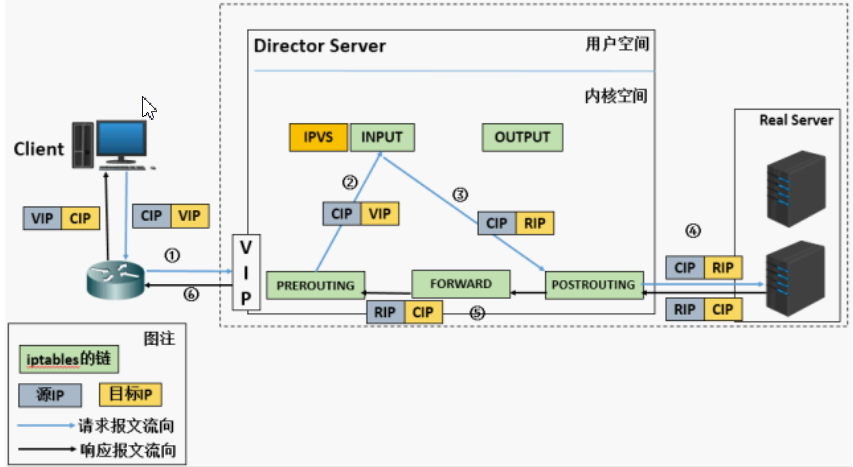
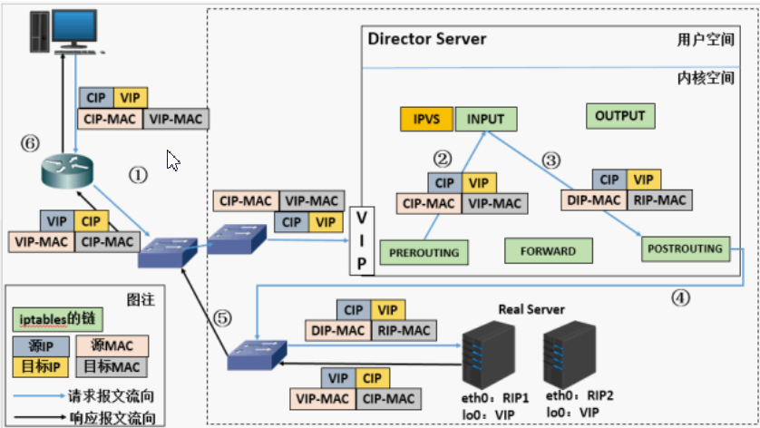
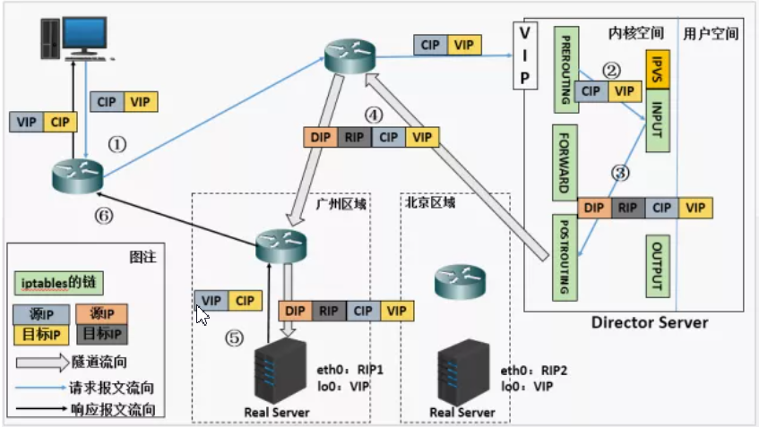
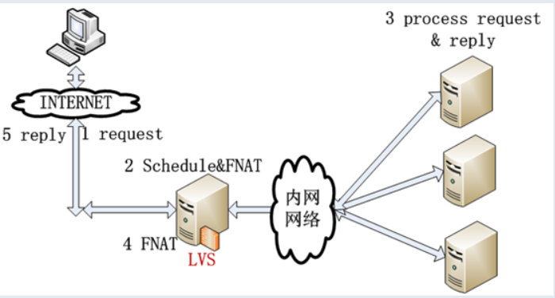
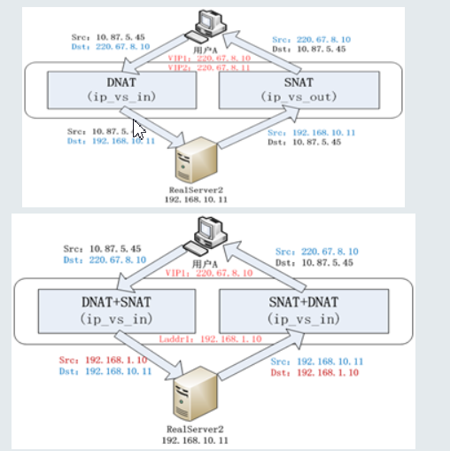
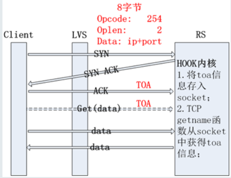
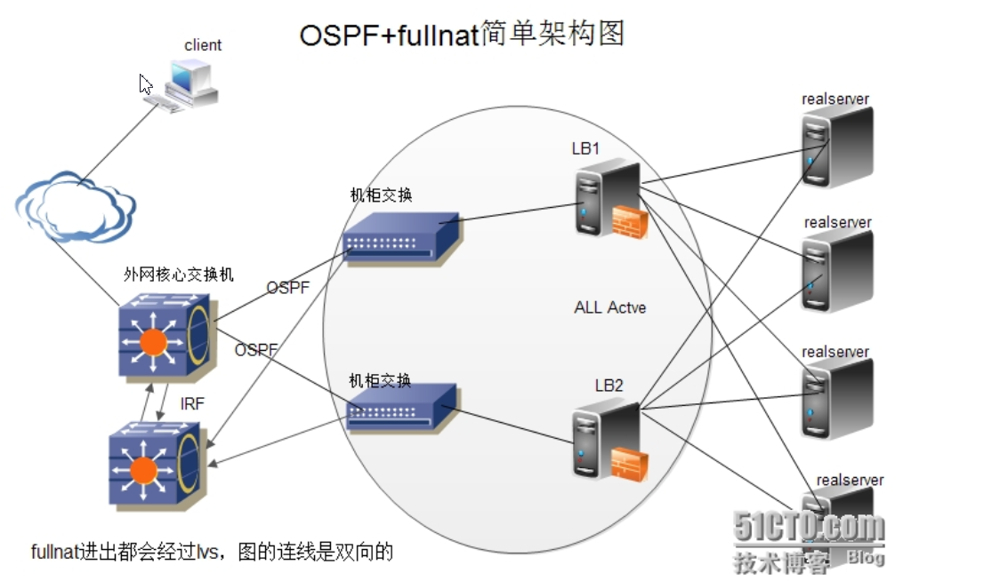
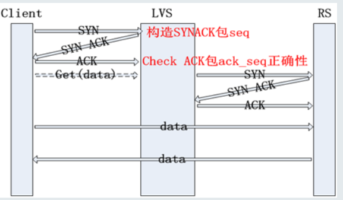

# 模式说明 dns+l4+l7
# dns说明
## 权威bind维护

## 缓存dnsdist维护

# 四层负载均衡 lvs
## 简介
- LVS是 Linux Virtual Server 的简称，也就是Linux虚拟服务器
- 这是一个由章文嵩博士发起的一个开源项目，它的官方网是 http://www.linuxvirtualserver.org
- 现在 LVS 已经是 Linux 内核标准的一部分
- 使用 LVS 可以达到的技术目标是：通过 LVS 达到的负载均衡技术和 Linux 操作系统实现一个高性能高可用的 Linux 服务器集群
- 它具有良好的可靠性、可扩展性和可操作性。从而以低廉的成本实现最优的性能。LVS 是一个实现负载均衡集群的开源软件项目，LVS架构从逻辑上可分为调度层、Server集群层和共享存储。

## 组成
> LVS 由2部分程序组成，包括 ipvs 和 ipvsadm。

1. ipvs(ip virtual server)：一段代码工作在内核空间，叫ipvs，是真正生效实现调度的代码。
2. ipvsadm：另外一段是工作在用户空间，叫ipvsadm，负责为ipvs内核框架编写规则，定义谁是集群服务，而谁是后端真实的服务器(Real Server)

## LVS相关术语

1. DS：Director Server。指的是前端负载均衡器节点。
2. RS：Real Server。后端真实的工作服务器。
3. VIP：向外部直接面向用户请求，作为用户请求的目标的IP地址。
4. DIP：Director Server IP，主要用于和内部主机通讯的IP地址。
5. RIP：Real Server IP，后端服务器的IP地址。
6. CIP：Client IP，访问客户端的IP地址。

## LVS/NAT原理和特点

1. 当用户请求到达Director Server，此时请求的数据报文会先到内核空间的PREROUTING链。 此时报文的源IP为CIP，目标IP为VIP
2. PREROUTING检查发现数据包的目标IP是本机，将数据包送至INPUT链
3. IPVS比对数据包请求的服务是否为集群服务，若是，修改数据包的目标IP地址为后端服务器IP，然后将数据包发至POSTROUTING链。 此时报文的源IP为CIP，目标IP为RIP
4. POSTROUTING链通过选路，将数据包发送给Real Server
5. Real Server比对发现目标为自己的IP，开始构建响应报文发回给Director Server。 此时报文的源IP为RIP，目标IP为CIP
6. Director Server在响应客户端前，此时会将源IP地址修改为自己的VIP地址，然后响应给客户端。 此时报文的源IP为VIP，目标IP为CIP

### LVS-NAT模型的特性

- RS应该使用私有地址，RS的网关必须指向DIP
- DIP和RIP必须在同一个网段内
- 请求和响应报文都需要经过Director Server，高负载场景中，Director Server易成为性能瓶颈
- 支持端口映射
- RS可以使用任意操作系统
- 缺陷：对Director Server压力会比较大，请求和响应都需经过director server

## LVS/DR原理和特点

1. 当用户请求到达Director Server，此时请求的数据报文会先到内核空间的PREROUTING链。 此时报文的源IP为CIP，目标IP为VIP
2. PREROUTING检查发现数据包的目标IP是本机，将数据包送至INPUT链
3. IPVS比对数据包请求的服务是否为集群服务，若是，将请求报文中的源MAC地址修改为DIP的MAC地址，将目标MAC地址修改RIP的MAC地址，然后将数据包发至POSTROUTING链。 此时的源IP和目的IP均未修改，仅修改了源MAC地址为DIP的MAC地址，目标MAC地址为RIP的MAC地址
4. 由于DS和RS在同一个网络中，所以是通过二层来传输。POSTROUTING链检查目标MAC地址为RIP的MAC地址，那么此时数据包将会发至Real Server。
5. RS发现请求报文的MAC地址是自己的MAC地址，就接收此报文。处理完成之后，将响应报文通过lo接口传送给eth0网卡然后向外发出。 此时的源IP地址为VIP，目标IP为CIP
6. 响应报文最终送达至客户端

### LVS-DR模型的特性

- 特点1：保证前端路由将目标地址为VIP报文统统发给Director Server，而不是RS
- 修改RS上内核参数（arp_ignore和arp_announce）将RS上的VIP配置在lo接口的别名上，并限制其不能响应对VIP地址解析请求
- RS可以使用私有地址；也可以是公网地址，如果使用公网地址，此时可以通过互联网对RIP进行直接访问
- RS跟Director Server必须在同一个物理网络中
- 所有的请求报文经由Director Server，但响应报文必须不能进过Director Server
- 不支持地址转换，也不支持端口映射
- RS可以是大多数常见的操作系统
- RS的网关绝不允许指向DIP(因为我们不允许他经过director)
- RS上的lo接口配置VIP的IP地址
- 缺陷：RS和DS必须在同一机房中

## LVS/Tun原理和特点
**在原有的IP报文外再次封装多一层IP首部，内部IP首部(源地址为CIP，目标IIP为VIP)，外层IP首部(源地址为DIP，目标IP为RIP)**

1. 当用户请求到达Director Server，此时请求的数据报文会先到内核空间的PREROUTING链。 此时报文的源IP为CIP，目标IP为VIP 。
2. PREROUTING检查发现数据包的目标IP是本机，将数据包送至INPUT链
3. IPVS比对数据包请求的服务是否为集群服务，若是，在请求报文的首部再次封装一层IP报文，封装源IP为为DIP，目标IP为RIP。然后发至POSTROUTING链。 此时源IP为DIP，目标IP为RIP
4. POSTROUTING链根据最新封装的IP报文，将数据包发至RS（因为在外层封装多了一层IP首部，所以可以理解为此时通过隧道传输）。 此时源IP为DIP，目标IP为RIP
5. RS接收到报文后发现是自己的IP地址，就将报文接收下来，拆除掉最外层的IP后，会发现里面还有一层IP首部，而且目标是自己的lo接口VIP，那么此时RS开始处理此请求，处理完成之后，通过lo接口送给eth0网卡，然后向外传递。 此时的源IP地址为VIP，目标IP为CIP
6. 响应报文最终送达至客户端

### LVS-Tun模型特性
- RIP、VIP、DIP全是公网地址
- RS的网关不会也不可能指向DIP
- 所有的请求报文经由Director Server，但响应报文必须不能进过Director Server
- 不支持端口映射
- RS的系统必须支持隧道

## LVS-FULLNAT转发模式

- FULLNAT转发数据包是类似NAT模式，IN和OUT数据包都是经过LVS；唯一的区别：后端RealServer 或者 交换机 不需要做任何配置。
- FULLNAT的主要原理是引入local address（内网ip地址），cip-vip转换为lip->rip，而 lip和rip均为IDC内网ip，可以跨vlan通讯；

- 如图所示，相比NAT模式，FullNAT多了一个Local IP，IP地址转换时，源和目的IP都改了，即SNAT DNAT
- FULLNAT一个最大的问题是：RealServer无法获得用户IP；为了解决这个问题我们提出了TOA的概念，主要原理是：将client address放到了TCP Option里面带给后端RealServer，RealServer上通过toa内核模块hack了getname函数，给用户态返回TCP Option中的client ip。

### 结合ospf做扩展

- OSPF优点：网络环境下同时使用多条链路，增加传输带宽，无延时无丢包的备份失效链路的数据传输
- FULLNAT优点： 解决lvs跨VLAN问题

## LVS-SYNPROXY
- LVS可以防御DDOS 4层标志位攻击，其中，synproxy是用于防御synflood攻击的模块；
- Synproxy实现的主要原理：参照linux tcp协议栈中syncookies的思想，LVS-构造特殊seq的synack包，验证ack包中ack_seq是否合法-实现了TCP三次握手代理；
- 简化一点说，就是client和LVS间建立3次握手，成功后，LVS再和RS建立3次握手；

## lvs 页面化
- salt lvs_server lvs_service
- 封装ipvsadm命令

## 类比lvs-dr 的katran 
- 2018年5月，Facebook开源了可扩展的网络负载均衡软件 Katran
- Katran完全重新设计的转发平面，比前一个版本有了显著改进
- 应用的技术是内核界的两种新技术：eXpress Data Path 和extended Berkeley Packet Filter，这使得其具有了几个优点：及早高效的数据包处理，成本低廉但更稳定的哈希，更有弹性的本地状态，对RSS友好的封装。

# 7层nginx
## nginx配置管理平台
- nginx页面配置系统
